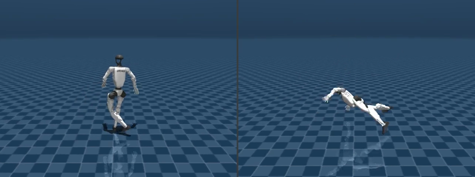
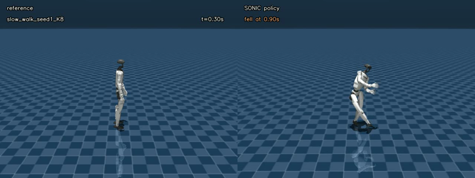
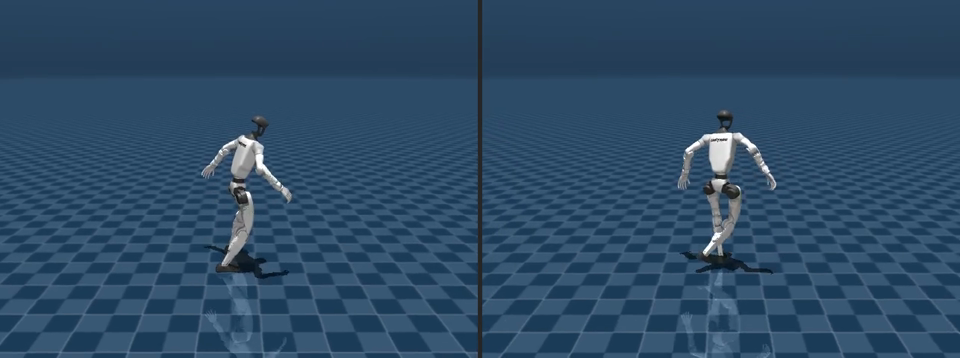
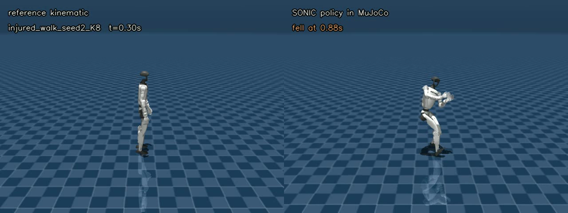
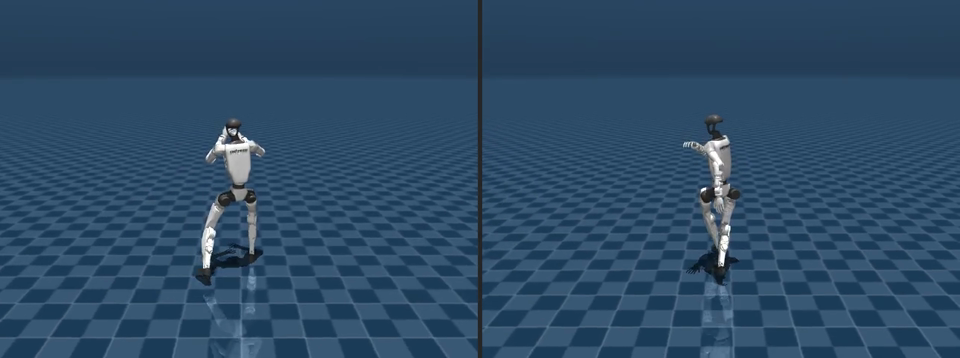
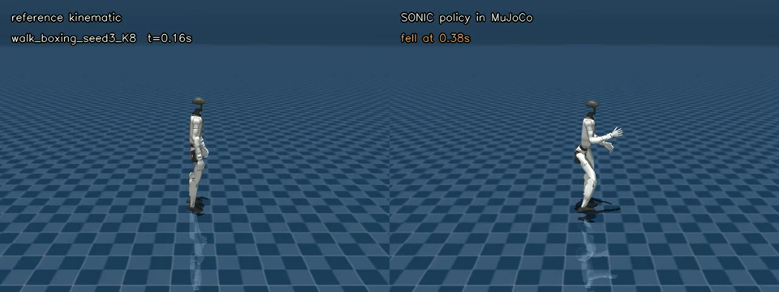

# Test-Time Physical-Awareness Refinement for Generative Humanoid Motion

Tae Hoon Yang  
CS 348K: Visual Computing Systems, Stanford, Spring 2026

## Motivation

Humanoid robots have made rapid progress in locomotion and whole-body control,
largely because reinforcement-learning policies can be trained to track
reference motions. DeepMimic showed how an RL policy can learn physics-based
character skills from example motion clips, and recent humanoid systems such as
GMT, BeyondMimic, and SONIC scale the same broad idea toward general whole-body
tracking on real robots [1-4]. Those references tell the controller what the
body should do over time: walk forward, turn, crouch, crawl, gesture with the
arms, or combine locomotion with expressive upper-body motion.

The bottleneck is that good reference motions are hard to create. Traditional
references often come from hand-authored keyframe animation or human motion
capture. Both require substantial setup, cleanup, retargeting, and robot-specific
refinement. A human motion that looks natural is not automatically feasible for
a robot with different joints, torque limits, contacts, and balance constraints;
recent tracking work explicitly identifies physically inconsistent references as
a source of tracking instability and sim-to-real difficulty [5].

Generative motion systems are attractive because they could produce many
candidate reference motions cheaply. Human-motion generation work such as
MotionCLIP shows the appeal of semantic motion authoring, while NVIDIA's GR00T
and GR00T Whole-Body Control stack point toward increasingly general humanoid
motion-generation and control workflows [6-8]. In this project I use
MotionBricks, a component of the NVIDIA GR00T Whole-Body Control release, for
generating composable humanoid motion references for the Unitree G1 robot model
[8]. MotionBricks produces kinematic trajectories: sequences of robot poses over
time. These trajectories can look good visually, but a kinematic generator does
not by itself guarantee that the robot can track the motion with realistic
torques, stable contacts, and no severe self-collisions.

This project studies the interface between generated kinematic motion and robot
tracking. Instead of training a new generator, I am building an evaluation
pipeline that asks whether generated references are physically plausible enough
to be useful for robot policy training or tracking.


## Project Question

Can physics-based evaluation identify when generated humanoid reference motions
are likely to be difficult for a real robot tracking policy?

This checkpoint focuses on defining and implementing the evaluation: generate
MotionBricks reference clips, score them with physics-derived diagnostics, check
whether they still match the intended motion, and audit a few examples with a
tracking controller.

The central hypothesis is:

> A generated humanoid motion can look reasonable in a kinematic viewer while
> still requiring unrealistic torques, contacts, or balance behavior. A useful
> evaluation should catch those cases before the motion is used for robot
> training or controller tracking.

## Background Terms

- **Reference motion:** the target pose trajectory that a robot tracking policy
  tries to follow.
- **MotionBricks:** the generative kinematic motion source used in this project.
  The public G1 preview exposes local modes such as `walk`, `walk_boxing`,
  `hand_crawling`, and `idle`, rather than a fully general natural-language
  text-to-motion endpoint.
- **MuJoCo inverse dynamics:** a physics diagnostic that asks what joint torques
  and unactuated root forces would be required to exactly replay a kinematic
  motion.
- **SONIC:** a learned Unitree G1 motion-tracking policy used here as a
  controller audit. It tests whether a generated reference can be tracked by an
  actual policy [4].
- **Candidate screening:** score generated candidate motions with the evaluation
  pipeline before using them as robot references.

## Method

The checkpoint method is an evaluation pipeline:

1. Generate Unitree G1 qpos reference clips from MotionBricks.
2. Score each candidate with a MuJoCo inverse-dynamics critic.
3. Measure torque demand, root wrench demand, contact artifacts, and smoothness.
4. Check whether task/style proxies still match the intended motion.
5. Run selected examples through SONIC as a controller audit.

The inverse-dynamics critic measures exact-replay demand, not closed-loop robot
success. SONIC is included as a validation audit, not as a final claim.

## Example Motion Requests

The public MotionBricks interface used here is a mode/control interface rather
than a fully open text-to-motion model. I still write each mode as a readable
prompt so the evaluation target is clear. The full prompt suite contains 15
MotionBricks modes x 7 seeds in `configs/prompt_suite_105.csv`; three examples
are shown below.

### Example 1: Slow Forward Walk

**Prompt:** "Walk forward slowly and carefully."

**Why this example:** slow walking is a basic locomotion reference. It should be
easier than expressive or crawling motions, so it is a sanity check that the
evaluation does not only focus on hard failures.

MotionBricks generated reference:



SONIC controller-audit snapshot:



### Example 2: Injured Uneven Walk

**Prompt:** "Walk forward with an injured uneven gait while staying upright."

**Why this example:** asymmetric walking is visually plausible but can be harder
to track because it may create uneven support, torque spikes, or unstable
contacts.

MotionBricks generated reference snapshot:



SONIC controller-audit snapshot:



### Example 3: Boxing-Style Walk

**Prompt:** "Walk forward while throwing boxing-style arm motions."

**Why this example:** expressive upper-body motion can look good while still
increasing torque demand, self-contact risk, or tracking error. This tests
whether screening keeps style while reducing physical risk.

MotionBricks generated reference snapshot:



SONIC controller-audit snapshot:



The same evaluation is intended to run on easy, medium, and hard examples. The
walking example above is a core locomotion case; crawling is a hard low-posture
contact case that should expose failures in contact and balance diagnostics.


## Week 6 Checkpoint Status

- The project question and evaluation protocol are defined.
- Evaluation code exists and runs on a bundled toy baseline in `data/synthetic/`.
- The full experiment path evaluates MotionBricks references with inverse
  dynamics, contact diagnostics, prompt/task proxy metrics, and SONIC tracking.
- Example generated-motion and controller-audit snapshots are included above.
- Large videos/result bundles are omitted from this lightweight GitHub push
  because Git LFS upload was unreliable; artifact names and local restore notes
  remain documented.
- The current checkpoint claim is only that the evaluation is defined and
  runnable, not that the final method has succeeded.

For the checkpoint, the goal is not to claim final success. The important
deliverable is that the evaluation is defined, implemented, and running on
baseline/generated motions.

## Evaluation Questions

- Which generated reference motions require high torque or root wrench demand?
- Which motions create contact artifacts such as skating or non-foot contacts?
- Do the physics diagnostics preserve the intended task/style categories?
- Do the diagnostic scores predict obvious SONIC tracking failures?

## Metrics

- Inverse-dynamics torque demand: p95 joint torque divided by actuator limit.
- Unactuated root demand: p95 root force and root torque.
- Smoothness/dynamics: joint velocity, acceleration, and jerk.
- Contact quality: self-contact, non-foot floor contact, foot skating, and
  support proxy diagnostics.
- Prompt/task proxy alignment: direction, speed, posture, and upper-body style
  proxies over the 105-row local mode-control suite.
- SONIC audit: time-to-fall and joint RMSE under a learned tracking policy
  harness.

## Checkpoint Success Criteria

For Week 6, success means the repository makes the evaluation concrete:

- A reader can understand the project question without knowing MotionBricks or
  SONIC beforehand.
- The README shows representative motion requests and visual examples.
- The code can run a smoke-test evaluation on bundled synthetic motion data.
- The metrics are explicit enough to say that an empty, noisy, or physically
  impossible motion is not a successful reference.
- The next experiments are clear: run the same metrics on the full generated
  MotionBricks suite and compare the diagnostics with controller rollouts.

## Repository Map

```text
src/physics_eval/      MuJoCo simulator, inverse dynamics, metrics, critic
src/analysis/          plotting and rendering helpers
scripts/               experiment, audit, render, and plotting scripts
tests/                 core evaluation tests
configs/               105-row local prompt/mode suite
assets/g1/             Unitree G1 MuJoCo XML; full mesh assets in local/full copy
data/synthetic/        tiny baseline clips for checkpoint smoke tests
artifacts/             selected visual examples and optional diagnostic outputs
release_assets/        checksum/readme placeholders for full local bundles
docs/                  evaluation protocol and project narrative
paper/                 paper draft snapshot
```

## Running the Checkpoint Baseline

Install the core dependencies:

```bash
python -m venv .venv
source .venv/bin/activate
pip install -r requirements.txt
```

Run tests:

```bash
pytest -q
```

Run the bundled toy baseline from the full local checkout, or after restoring
the full G1 mesh assets:

```bash
python run_eval.py --data_dir data/synthetic --kinematic_baseline --inverse_dynamics --no_plot
```

Run diagnostic scripts after restoring full results/data:

```bash
python scripts/evaluate_prompt_alignment.py
python scripts/evaluate_contact_quality.py
```

Optional MotionBricks generation requires NVIDIA GPU setup and the external
MotionBricks package:

```bash
python generate_motions.py
python run_eval.py --data_dir data/motionbricks --full_report
```

## Artifacts

Start with:

- `artifacts/video_placeholders/walk_seed0_risk_explainer_preview.png`
- `artifacts/video_placeholders/hand_crawling_risk_preview.png`
- `artifacts/example_snapshots/motionbricks/slow_walk_seed0.png`
- `artifacts/example_snapshots/motionbricks/injured_walk.png`
- `artifacts/example_snapshots/motionbricks/walk_boxing.png`
- `artifacts/example_snapshots/sonic/slow_walk.png`
- `artifacts/example_snapshots/sonic/injured_walk.png`
- `artifacts/example_snapshots/sonic/walk_boxing.png`

Representative prompt text, why those modes were chosen, and the MotionBricks
and SONIC video map are in `docs/motion_examples.md`.

Video artifact names and full-result restore notes are documented in
`artifacts/README.md` and `release_assets/README.md`.

## Limitations

- The critic is heuristic and does not certify hardware safety.
- The public MotionBricks preview used here exposes local mode/control prompts,
  not a full arbitrary text-to-motion endpoint.
- Semantic preservation is measured with proxies, not human preference labels.
- Inverse-dynamics diagnostics do not yet imply robust SONIC tracking.
- The most publishable next step is to compare diagnostic predictions against
  controller rollouts and then put the tracking policy in the evaluation loop.

## References

[1] Xue Bin Peng, Pieter Abbeel, Sergey Levine, and Michiel van de Panne.
**DeepMimic: Example-Guided Deep Reinforcement Learning of Physics-Based
Character Skills.** SIGGRAPH 2018. arXiv:1804.02717.
https://arxiv.org/abs/1804.02717

[2] Zixuan Chen, Mazeyu Ji, Xuxin Cheng, Xuanbin Peng, Xue Bin Peng, and Xiaolong
Wang. **GMT: General Motion Tracking for Humanoid Whole-Body Control.** arXiv
preprint, 2025. arXiv:2506.14770. https://arxiv.org/abs/2506.14770

[3] Takara E. Truong, Qiayuan Liao, Xiaoyu Huang, Guy Tevet, C. Karen Liu, and
Koushil Sreenath. **BeyondMimic: From Motion Tracking to Versatile Humanoid
Control via Guided Diffusion.** arXiv preprint, 2025. arXiv:2508.08241.
https://arxiv.org/abs/2508.08241

[4] Zhengyi Luo et al. **SONIC: Supersizing Motion Tracking for Natural Humanoid
Whole-Body Control.** arXiv preprint, 2025. arXiv:2511.07820.
https://arxiv.org/abs/2511.07820

[5] Yuhan Li, Peiyuan Zhi, Yunshen Wang, Tengyu Liu, Sixu Yan, Wenyu Liu,
Xinggang Wang, Baoxiong Jia, and Siyuan Huang. **OmniTrack: General Motion
Tracking via Physics-Consistent Reference.** arXiv preprint, 2026.
arXiv:2602.23832. https://arxiv.org/abs/2602.23832

[6] Guy Tevet, Brian Gordon, Amir Hertz, Amit H. Bermano, and Daniel Cohen-Or.
**MotionCLIP: Exposing Human Motion Generation to CLIP Space.** ECCV 2022.
arXiv:2203.08063. https://arxiv.org/abs/2203.08063

[7] NVIDIA et al. **GR00T N1: An Open Foundation Model for Generalist Humanoid
Robots.** arXiv preprint, 2025. arXiv:2503.14734.
https://arxiv.org/abs/2503.14734

[8] NVIDIA / NVLabs. **GR00T Whole-Body Control.** Software release and
documentation for humanoid whole-body control workflows, including SONIC and
MotionBricks components. https://github.com/NVlabs/GR00T-WholeBodyControl
