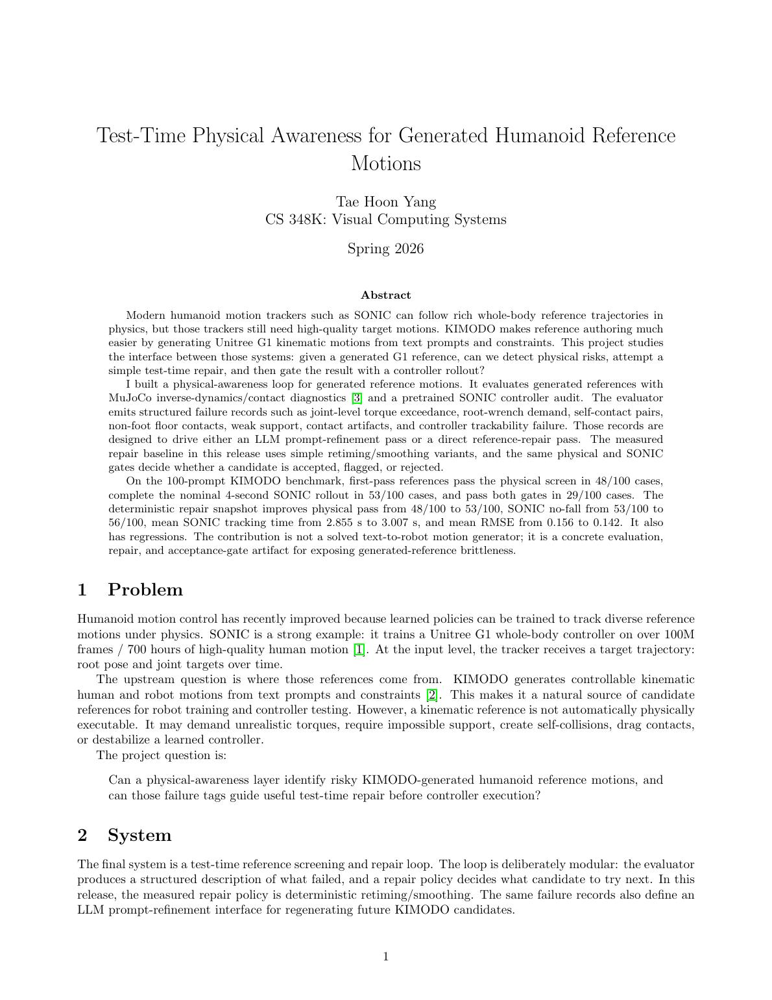
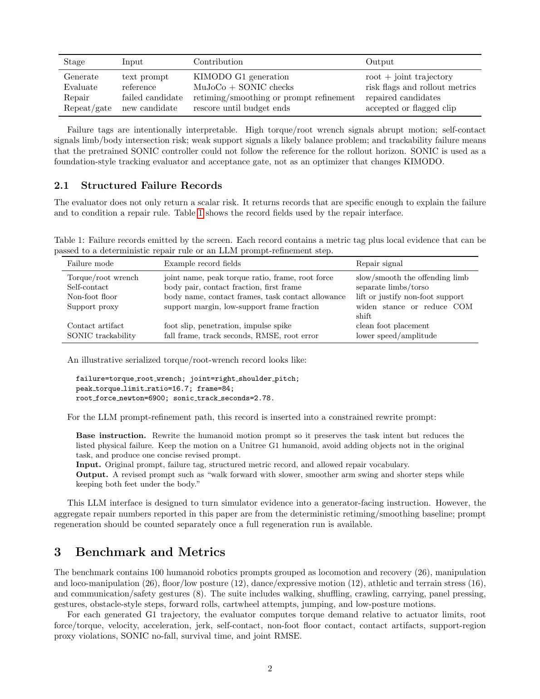
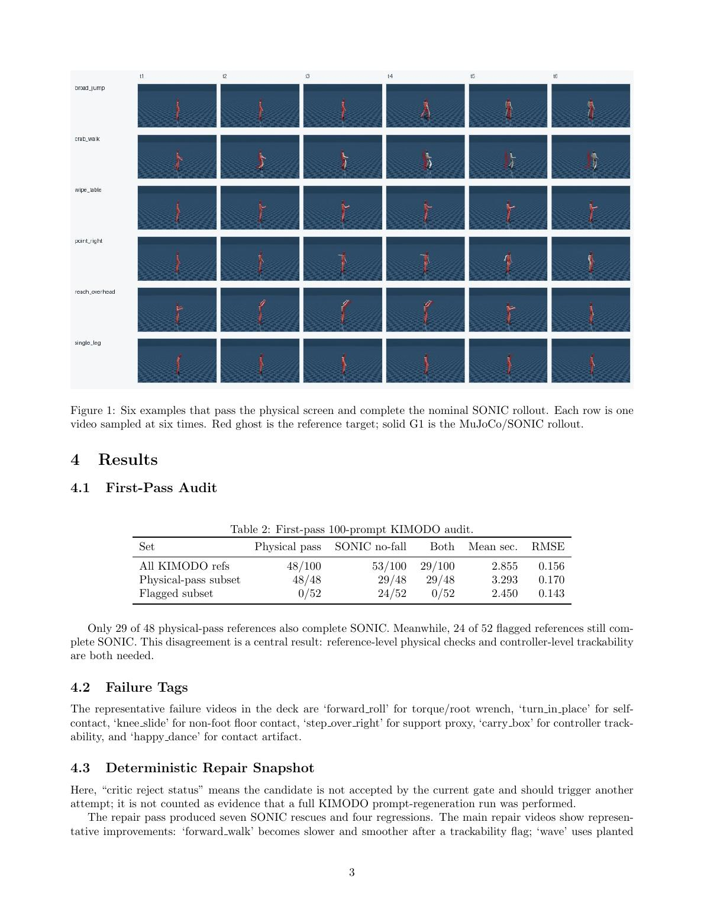
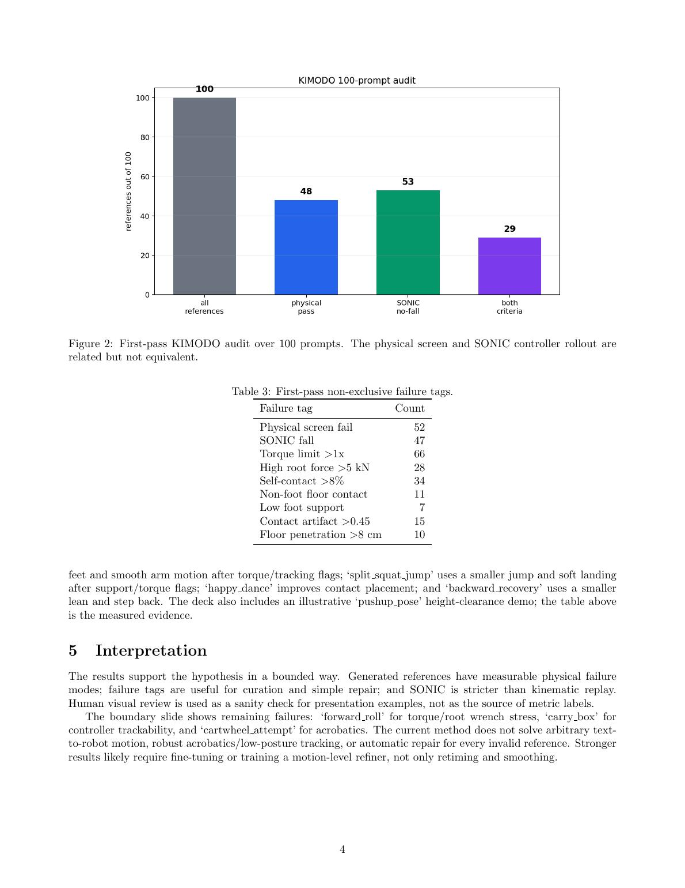
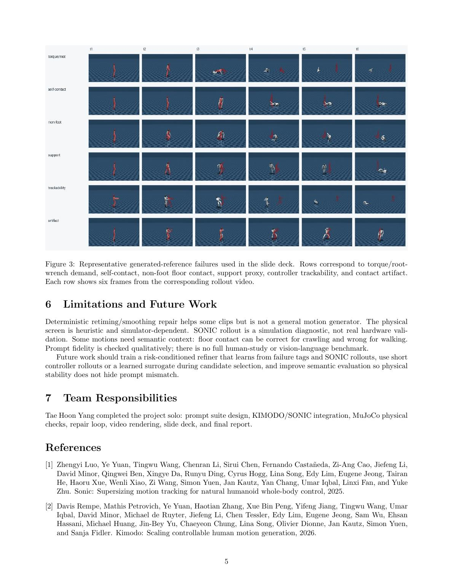
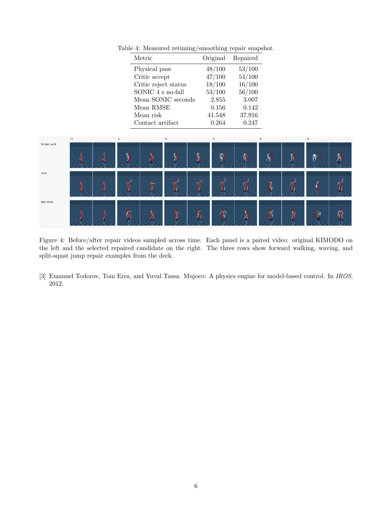
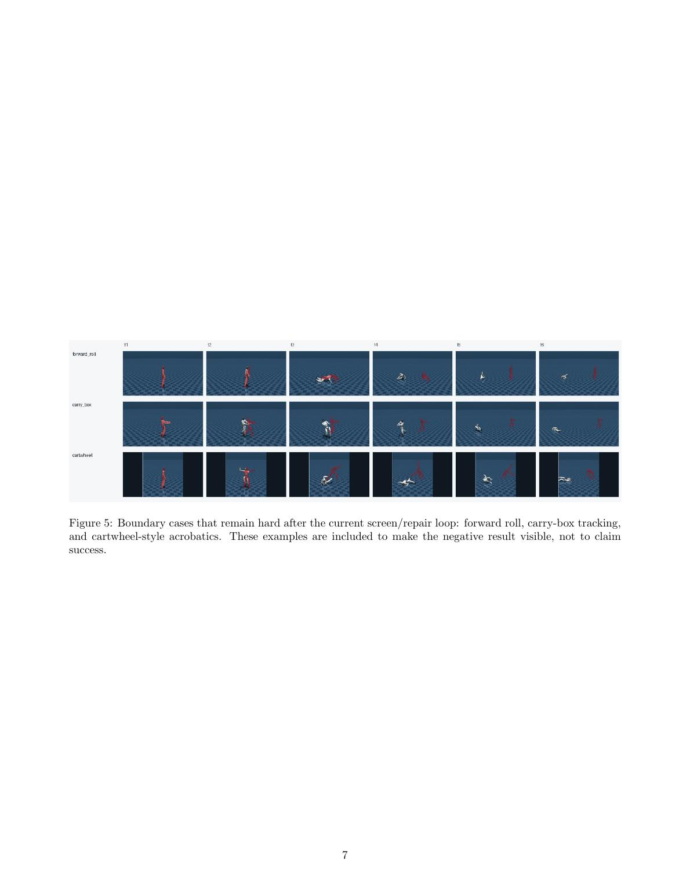

# Final Report

**Paper PDF:** [paper/main.pdf](paper/main.pdf)  
**Full report Markdown:** [docs/final_report.md](docs/final_report.md)









# CS348K Final Release

Final project: **Physical Awareness for Generated Humanoid Motion**.

This release contains the final slides, report, and selected video/figure
artifacts for a test-time physical-audit and reference-repair loop for
KIMODO-generated Unitree G1 reference motions. The system uses MuJoCo physical
checks and SONIC rollout evidence to produce structured failure records. Those
records support LLM prompt refinement or direct repair; the measured baseline
in this release tests simple retiming/smoothing repairs before accepting,
flagging, or rejecting references.

## Start Here

- [Final slides PDF](slides/build/deck.pdf)
- [Final slides PPTX](slides/build/deck.pptx)
- [Final report](docs/final_report.md)
- [Compact report PDF](paper/main.pdf)
- [All 100 KIMODO reference + SONIC rollout videos](videos/kimodo100/ref_plus_sonic/)
- [KIMODO100 SONIC metrics](metrics/kimodo100_sonic_tracking_cuda.csv)

## One-Line Result

First-pass KIMODO references are often plausible but brittle: 48/100 pass the
physical screen, 53/100 complete the nominal 4-second SONIC rollout, and 29/100
pass both gates. Deterministic test-time repair improves a small set of clips,
but does not solve arbitrary text-to-robot motion.

## Viewing

This repo uses Git LFS for embedded slide videos. On a new machine, install
Git LFS once and pull media objects:

```bash
git lfs install
git lfs pull
```

```bash
open slides/build/deck.pdf
open slides/build/deck.pptx
```

On Linux:

```bash
xdg-open slides/build/deck.html
```

To rebuild the deck:

```bash
python -m pip install -r requirements.txt
bash slides/build_slides.sh
```

Selected videos and posters used by the slides live under `slides/assets/`.
Final helper scripts are in `scripts/`; raw experiment directories remain in
the dev repo and are intentionally not part of this clean release.
