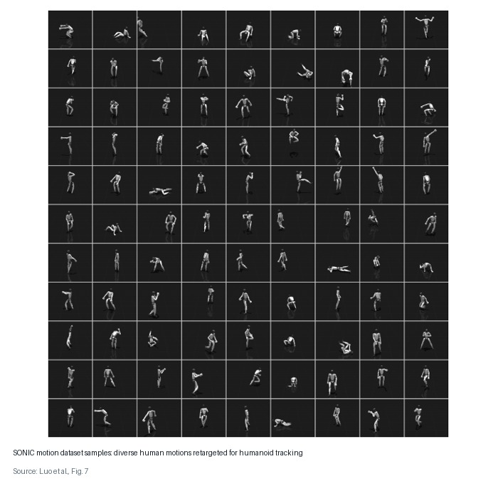
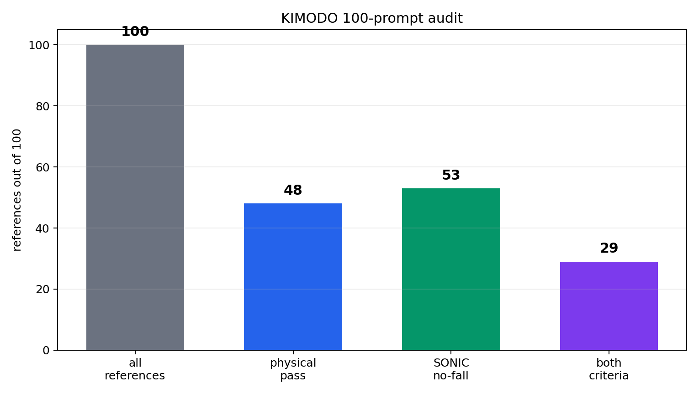

<!-- _class: title -->

# Physical Awareness for Generated Humanoid Motion

A test-time physical audit and repair loop for humanoid reference motions

CS348K Final Project  
Tae Hoon Yang

---

## Major Advances in Humanoid Motion Tracking

Modern humanoid trackers can follow high-quality motion clips in physics.

SONIC trains on over 100M frames / 700 hours of high-quality human motion.

The paper describes these motions as retargeted to the humanoid before tracking.

Tracking is getting strong. Where do these reference motions come from?

<video src="https://nvlabs.github.io/GEAR-SONIC/static/videos/teaser_title.mp4" poster="assets/video_posters/sonic_official.jpg" autoplay muted loop playsinline preload="metadata"></video>

Luo et al., "SONIC: Supersizing Motion Tracking for Natural Humanoid Whole-Body Control"

---

## KIMODO Makes References Easy To Generate

KIMODO generates G1 reference motions from text and kinematic constraints.

It is trained on 700 hours of production-quality optical mocap.

This gives us a broad 100-prompt humanoid reference-motion suite.

But kinematic generation does not by itself guarantee:

- feasible torques,
- valid support contacts,
- prompt correctness,
- trackability by a learned controller.

We insert a physical-awareness screen and repair loop after KIMODO and before tracking.

<video src="assets/videos/kimodo_official/kimodo_g1_text_loco.mp4" poster="assets/video_posters/kimodo_official/kimodo_g1_text_loco.jpg" autoplay muted loop playsinline preload="metadata"></video>

Rempe et al., "Kimodo: Scaling Controllable Human Motion Generation"

---

## What Exactly Are We Refining?

We refine generated references using failures observed in the G1 trajectory.

Each clip contains root pose and joint angles over time.

From each generated clip, we derive:

- velocity and acceleration,
- contact diagnostics,
- SONIC tracking diagnostics.

A prompt can produce a plausible replay and still need a safer reference variant.

<video src="assets/videos/kimodo_failures_selected/trackability__hrb_001_forward_walk__sonic_fell3p46s_torque4p29x_rootforce6593N.mp4" poster="assets/video_posters/kimodo_failures_selected/trackability__hrb_001_forward_walk__sonic_fell3p46s_torque4p29x_rootforce6593N.jpg" autoplay muted loop playsinline preload="metadata" style="width:100%; max-height:330px; background:#101820; border:1px solid #cfd8df;"></video>

Local G1 example: the reference replay looks plausible, but the physics rollout becomes unstable. This failure tag tells the repair loop what kind of variant to try next.

---

## Evaluation Questions

Success has to be measured twice: first on the reference, then in the controller.

We ask four questions:

- How many first-pass KIMODO references pass physical rules?
- Which failure tags should drive repair attempts?
- Do refined or lower-risk references survive longer under SONIC?
- Which clips pass both physical rules and controller rollout?

Metric definitions:

- **physical pass:** torque/root-wrench, contact, and support thresholds,
- **SONIC no-fall:** full-horizon controller rollout,
- **RMSE:** joint tracking error,
- **failure tag:** structured context for reference repair.

Araujo et al., "Retargeting Matters: General Motion Retargeting for Humanoid Motion Tracking," arXiv:2510.02252.

---

## What We Built

### Baseline

- one generated clip per prompt,
- KIMODO G1 reference trajectory,
- no test-time refinement loop.

### Our Layer: Screen + Repair

- generate a KIMODO reference,
- check dynamics/contact/support rules,
- run SONIC for rollout evidence,
- try retiming/smoothing repair variants,
- accept, flag, or reject the reference.

---

## Method: Physical-Awareness Loop

  
<strong>1. Generate</strong>KIMODO reference from the current text prompt

  
<strong>2. Evaluate</strong>rules on the reference plus SONIC rollout checks

  
<strong>3. Repair</strong>retime and smooth candidate reference variants

  
<strong>4. Gate</strong>accept, flag, or reject after rescoring

<small>No generator or controller fine-tuning here: physics rules and SONIC decide whether a reference variant passes.</small>

---

<!-- _class: compact -->

## Repair: Metric-Guided Variants

When a candidate fails, the failed metric tells us what kind of reference variant to try.

Then we rescore the variants with the same physical rules and SONIC gate.

| Failure tag | Repair pressure before rescoring |
|---|---|
| high torque / root wrench | slower, smoother limb motion; avoid abrupt arm swings or snaps |
| self-contact | keep arms away from torso; avoid crossing legs or shoulders |
| non-foot floor contact | use feet-only support unless the task explicitly says crawl or kneel |
| support proxy | wider stance; planted support foot; smaller center-of-mass shift |
| contact artifact | clean foot placement; avoid dragging or sliding contacts |
| trackability failure | reduce speed and amplitude; make transitions gradual |

The repair stays interpretable: every new candidate is tied to the metric that failed.

Araujo et al., "Retargeting Matters: General Motion Retargeting for Humanoid Motion Tracking," arXiv:2510.02252.

---

<!-- _class: compact -->

## 100-Prompt Humanoid Suite

KIMODO can attempt the full prompt suite directly on the G1 skeleton.

We use concrete text prompts, not just motion labels.

<strong>Benchmark caveat:</strong> some prompts are beyond current tracker capability, so failure is useful evidence rather than just a bad generation.

| Family | Count | Example text prompts |
|---|---:|---|
| locomotion + recovery | 26 | "Walk forward at a comfortable indoor pace." |
| manipulation + loco-manipulation | 26 | "Step forward, reach with the right hand as if opening a door." |
| floor / low posture | 12 | "Crawl forward using hands and feet." |
| dance / expressive | 12 | "Do an energetic happy dance with bouncing knees." |
| athletic + terrain stress | 16 | "Perform a small split-squat jump." |
| communication / safety | 8 | "Stand still and wave the right hand at shoulder height." |

---

## Generated Reference Examples

<video src="assets/videos/kimodo_reference_family_examples/hrb_001_forward_walk_forward_walk_reference.mp4" poster="assets/video_posters/kimodo_reference_family_examples/hrb_001_forward_walk_forward_walk_reference.jpg" autoplay muted loop playsinline preload="metadata"></video>

<strong>locomotion + recovery</strong> forward_walk

<video src="assets/videos/kimodo_reference_family_examples/hrb_056_open_door_open_door_reference.mp4" poster="assets/video_posters/kimodo_reference_family_examples/hrb_056_open_door_open_door_reference.jpg" autoplay muted loop playsinline preload="metadata"></video>

<strong>manipulation + loco-manipulation</strong> open_door

<video src="assets/videos/kimodo_reference_family_examples/hrb_027_hand_crawl_hand_crawl_reference.mp4" poster="assets/video_posters/kimodo_reference_family_examples/hrb_027_hand_crawl_hand_crawl_reference.jpg" autoplay muted loop playsinline preload="metadata"></video>

<strong>floor / low posture</strong> hand_crawl

<video src="assets/videos/kimodo_reference_family_examples/hrb_018_happy_dance_happy_dance_reference.mp4" poster="assets/video_posters/kimodo_reference_family_examples/hrb_018_happy_dance_happy_dance_reference.jpg" autoplay muted loop playsinline preload="metadata"></video>

<strong>dance / expressive</strong> happy_dance

<video src="assets/videos/kimodo_reference_family_examples/hrb_097_split_squat_jump_split_squat_jump_reference.mp4" poster="assets/video_posters/kimodo_reference_family_examples/hrb_097_split_squat_jump_split_squat_jump_reference.jpg" autoplay muted loop playsinline preload="metadata"></video>

<strong>athletic + terrain stress</strong> split_squat_jump

<video src="assets/videos/kimodo_reference_family_examples/hrb_077_wave_wave_reference.mp4" poster="assets/video_posters/kimodo_reference_family_examples/hrb_077_wave_wave_reference.jpg" autoplay muted loop playsinline preload="metadata"></video>

<strong>communication / safety</strong> wave

Reference-only KIMODO outputs rendered on the G1 mesh. No physics rollout is shown on this slide.

---

## First-Pass References Can Already Track

<video src="assets/videos/kimodo_success_selected/success__hrb_008_broad_jump__physical_pass_sonic_no_fall.mp4" poster="assets/video_posters/kimodo_success_selected/success__hrb_008_broad_jump__physical_pass_sonic_no_fall.jpg" autoplay muted loop playsinline preload="metadata"></video>

<strong>broad_jump</strong> physical pass + SONIC no-fall

<video src="assets/videos/kimodo_success_selected/success__hrb_030_crab_walk__physical_pass_sonic_no_fall.mp4" poster="assets/video_posters/kimodo_success_selected/success__hrb_030_crab_walk__physical_pass_sonic_no_fall.jpg" autoplay muted loop playsinline preload="metadata"></video>

<strong>crab_walk</strong> physical pass + SONIC no-fall

<video src="assets/videos/kimodo_success_selected/success__hrb_043_wipe_table__physical_pass_sonic_no_fall.mp4" poster="assets/video_posters/kimodo_success_selected/success__hrb_043_wipe_table__physical_pass_sonic_no_fall.jpg" autoplay muted loop playsinline preload="metadata"></video>

<strong>wipe_table</strong> physical pass + SONIC no-fall

<video src="assets/videos/kimodo_success_selected/success__hrb_080_point_right__physical_pass_sonic_no_fall.mp4" poster="assets/video_posters/kimodo_success_selected/success__hrb_080_point_right__physical_pass_sonic_no_fall.jpg" autoplay muted loop playsinline preload="metadata"></video>

<strong>point_right</strong> physical pass + SONIC no-fall

<video src="assets/videos/kimodo_success_candidates_review/success__hrb_041_reach_overhead__physical_pass_no_fall.mp4" poster="assets/video_posters/kimodo_success_candidates_review/success__hrb_041_reach_overhead__physical_pass_no_fall.jpg" autoplay muted loop playsinline preload="metadata"></video>

<strong>reach_overhead</strong> physical pass + SONIC no-fall

<video src="assets/videos/kimodo_success_selected/success__hrb_065_single_leg_balance_right__physical_pass_sonic_no_fall.mp4" poster="assets/video_posters/kimodo_success_selected/success__hrb_065_single_leg_balance_right__physical_pass_sonic_no_fall.jpg" autoplay muted loop playsinline preload="metadata"></video>

<strong>single_leg_balance</strong> physical pass + SONIC no-fall

Six generated references pass the physical rules and complete SONIC immediately. Red ghost = reference; solid G1 = controller rollout.

---

<!-- _class: compact -->

## First-Pass KIMODO Audit

| Set | Physical Pass | SONIC No-Fall | Mean SONIC Sec. | Mean RMSE |
|---|---:|---:|---:|---:|
| all KIMODO refs | 48/100 | 53/100 | 2.855 | 0.156 |
| physical-pass subset | 48/48 | 29/48 | 3.293 | 0.170 |
| flagged subset | 0/52 | 24/52 | 2.450 | 0.143 |

Controller check: 29/48 physical-pass references also complete SONIC; flagged references complete less often and track for less time.

Full 100-prompt KIMODO run. Failure tags identify references that need repair or rejection before deployment.

---

## Generated Failure Modes

<video src="assets/videos/appendix_metric_failures/torque_demand__hrb_094_forward_roll.mp4" poster="assets/video_posters/presentation_failure_modes/torque_demand__hrb_094_forward_roll__late.jpg" autoplay muted loop playsinline preload="metadata"></video>

<strong>Torque/root wrench</strong> forward_roll, 16.7x

<video src="assets/videos/kimodo_failures_selected/self_contact__hrb_005_turn_in_place__selfcontact75pct_torque18p86x.mp4" poster="assets/video_posters/presentation_failure_modes/self_contact__hrb_005_turn_in_place__selfcontact75pct_torque18p86x__late.jpg" autoplay muted loop playsinline preload="metadata"></video>

<strong>Self-contact</strong> turn_in_place

<video src="assets/videos/appendix_metric_failures/nonfoot_floor__hrb_098_knee_slide.mp4" poster="assets/video_posters/presentation_failure_modes/nonfoot_floor__hrb_098_knee_slide__late.jpg" autoplay muted loop playsinline preload="metadata"></video>

<strong>Non-foot floor</strong> knee_slide

<video src="assets/videos/kimodo_failure_candidates_review/support_proxy__hrb_085_step_over_right__support14pct.mp4" poster="assets/video_posters/presentation_failure_modes/support_proxy__hrb_085_step_over_right__support14pct__late.jpg" autoplay muted loop playsinline preload="metadata"></video>

<strong>Support proxy</strong> step_over_right

<video src="assets/videos/kimodo_failure_candidates_review/trackability__hrb_051_carry_box__fell2p78s.mp4" poster="assets/video_posters/presentation_failure_modes/trackability__hrb_051_carry_box__fell2p78s__late.jpg" autoplay muted loop playsinline preload="metadata"></video>

<strong>Trackability</strong> carry_box

<video src="assets/videos/appendix_metric_failures/contact_support__hrb_018_happy_dance.mp4" poster="assets/video_posters/presentation_failure_modes/contact_support__hrb_018_happy_dance__late.jpg" autoplay muted loop playsinline preload="metadata"></video>

<strong>Contact artifact</strong> happy_dance

KIMODO references replayed through SONIC. Red ghost = reference; solid G1 = rollout. Failure labels come from metrics.

---

<!-- _class: compact failure-stats-slide -->

## Failure Stats Across 100 KIMODO Clips

  

    <strong>52</strong>
    physical-rule fail
  

  

    <strong>47</strong>
    SONIC fall
  

  

    <strong>66</strong>
    torque limit &gt;1x
  

Failure flags are non-exclusive: one clip can violate actuation, contact, and controller tracking.

  
physical-rule fail<b>52</b>

  
SONIC fall<b>47</b>

  
torque limit &gt;1x<b>66</b>

  
high root force &gt;5kN<b>28</b>

  
self-contact &gt;8%<b>34</b>

  
contact artifact &gt;0.45<b>15</b>

  
non-foot floor contact<b>11</b>

  
floor penetration &gt;8cm<b>10</b>

  
low foot support<b>7</b>

---

<!-- _class: compact repair-improvement-slide -->

## Deterministic Repair Helps Some Clips

  SONIC no-fall
  <strong>53 &rarr; 56</strong>
  <em>7 rescues, 4 regressions in the repair pass</em>

  

    physical pass
    48 &rarr; 53
    +5
    100 clips
  

  

    critic accept
    47 &rarr; 54
    +7
    100 clips
  

  

    reject / regenerate
    18 &rarr; 16
    -2
    100 clips
  

  

    mean risk
    41.5 &rarr; 37.9
    -3.6
    lower is better
  

  

    mean RMSE
    0.156 &rarr; 0.142
    -0.014
    lower is better
  

Repair baseline: deterministic retiming/smoothing variants selected by the same physical-awareness critic and SONIC gate.

---

<!-- _class: compact -->

## Real Repair Rescues

<video src="assets/videos/kimodo_repair_rescues_presentation/rescue_preview__dynamic_locomotion__hrb_001_forward_walk__trim_end1s.mp4" poster="assets/video_posters/kimodo_repair_rescues_presentation/rescue_preview__dynamic_locomotion__hrb_001_forward_walk__trim_end1s.jpg" autoplay muted loop playsinline preload="metadata"></video>

<strong>forward_walk</strong> caught: trackability prompt: slower, smoother steps

<video src="assets/videos/kimodo_repair_rescues/rescue__communication_safety__hrb_077_wave__3p86s_to_4p00s.mp4" poster="assets/video_posters/kimodo_repair_rescues/rescue__communication_safety__hrb_077_wave__3p86s_to_4p00s.jpg" autoplay muted loop playsinline preload="metadata"></video>

<strong>wave</strong> caught: torque / tracking prompt: planted feet, smooth arm

<video src="assets/videos/kimodo_repair_rescues_presentation/rescue_preview__athletic_stress__hrb_097_split_squat_jump__trim_end1s.mp4" poster="assets/video_posters/kimodo_repair_rescues_presentation/rescue_preview__athletic_stress__hrb_097_split_squat_jump__trim_end1s.jpg" autoplay muted loop playsinline preload="metadata"></video>

<strong>split_squat_jump</strong> caught: support / torque prompt: smaller jump, soft landing

Three representative repair previews. Left side is original KIMODO, right side is repaired. Within each panel: red ghost = reference; solid G1 = physics rollout.

---

<!-- _class: compact -->

## Additional Repair Evidence

<video src="assets/videos/kimodo_repair_rescues/pushup_pose_height_offset_demo.mp4" poster="assets/video_posters/kimodo_repair_rescues/pushup_pose_height_offset_demo.jpg" autoplay muted loop playsinline preload="metadata"></video>

<strong>pushup_pose</strong> height-clearance demo repair pressure: lift torso

<video src="assets/videos/appendix_repair_by_category/dance_expressive/repair_delta__hrb_018_happy_dance__no_to_no.mp4" poster="assets/video_posters/appendix_repair_by_category/dance_expressive/repair_delta__hrb_018_happy_dance__no_to_no.jpg" autoplay muted loop playsinline preload="metadata"></video>

<strong>happy_dance</strong> risk reduction, still flagged repair pressure: clean foot placement

<video src="assets/videos/kimodo_repair_rescues/rescue__balance_recovery__hrb_070_backward_recovery__3p38s_to_4p00s.mp4" poster="assets/video_posters/kimodo_repair_rescues/rescue__balance_recovery__hrb_070_backward_recovery__3p38s_to_4p00s.jpg" autoplay muted loop playsinline preload="metadata"></video>

<strong>backward_recovery</strong> support-proxy rescue repair pressure: smaller lean

Supporting examples, not all SONIC rescues. Red ghost = reference; solid G1 = rollout or visual repair proxy.

---

<!-- _class: compact -->

## Boundary: What Still Fails

<video src="assets/videos/appendix_metric_failures/torque_demand__hrb_094_forward_roll.mp4" poster="assets/video_posters/appendix_metric_failures/torque_demand__hrb_094_forward_roll.jpg" autoplay muted loop playsinline preload="metadata"></video>

<strong>forward_roll</strong> torque/root wrench

<video src="assets/videos/appendix_metric_failures/sonic_trackability__hrb_051_carry_box.mp4" poster="assets/video_posters/appendix_metric_failures/sonic_trackability__hrb_051_carry_box.jpg" autoplay muted loop playsinline preload="metadata"></video>

<strong>carry_box</strong> controller trackability

<video src="assets/videos/boundary_still_fails/cartwheel_attempt_repaired_right.mp4" poster="assets/video_posters/boundary_still_fails/cartwheel_attempt_repaired_right.jpg" autoplay muted loop playsinline preload="metadata"></video>

<strong>cartwheel_attempt</strong> torque/root wrench

Still unsolved: arbitrary text-to-robot motion; robust acrobatics and low postures; automatic repair for every invalid reference.

---

<!-- _class: compact limitations-slide -->

## Limitations

<strong>Reference repair is useful, not enough</strong>
Retiming and smoothing can rescue some clips. Stronger text-to-motion stability likely needs fine-tuning or a learned motion-level refiner.

<strong>Tracker-as-foundation is an assumption</strong>
We treat SONIC as a foundation motion tracker, but uncovered motions remain a weak point. Dataset coverage still matters.

<strong>Trackability is still hard to certify</strong>
If a generated reference fails, deciding whether RL could learn to track it is a harder problem than our test-time metric screen.

<strong>Iteration has deployment cost</strong>
Repair and audit take extra test-time iterations, but catching infeasible motion before controller execution is still important for real-world deployment.

Main point: metric-guided reference repair can reject or improve generated references, but it does not replace better generators, broader tracker training, or deployment-time safety checks.

